# Pac-Man

Classic Pac-Man game written in C++ for terminal.
The game features classic arcade mechanics, where the player navigates a maze, collects pellets, and avoids ghosts.

## Screenshots

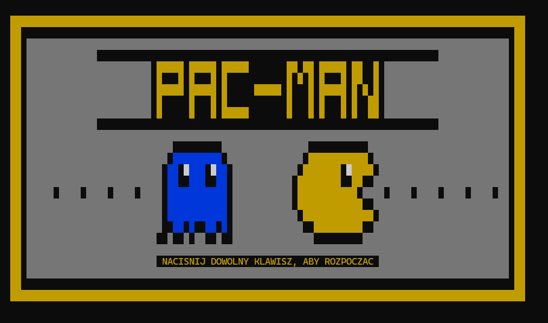
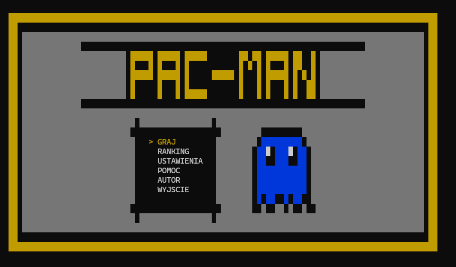
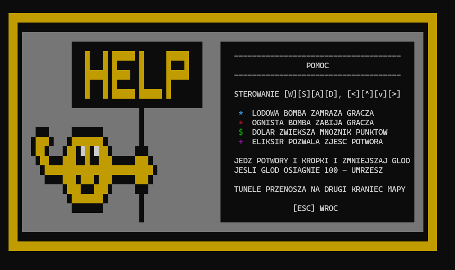
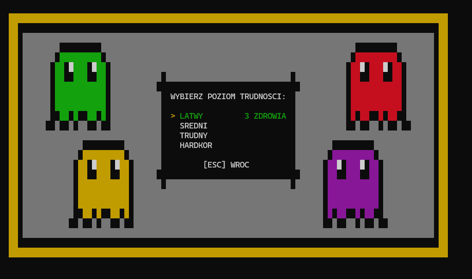
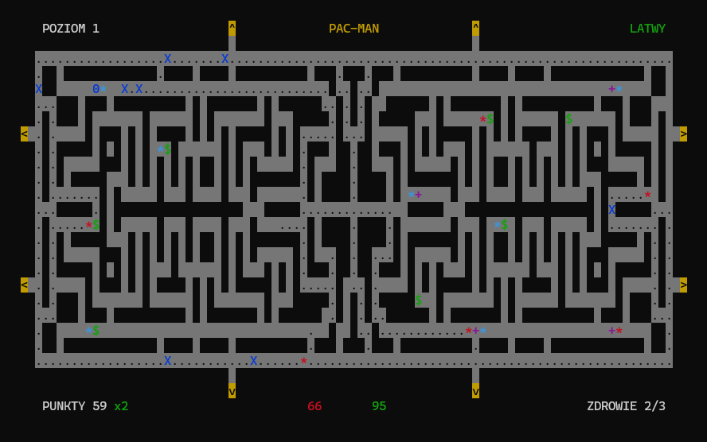
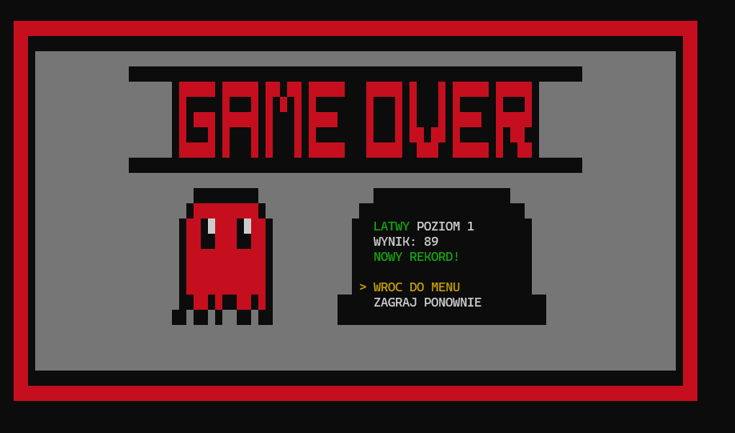
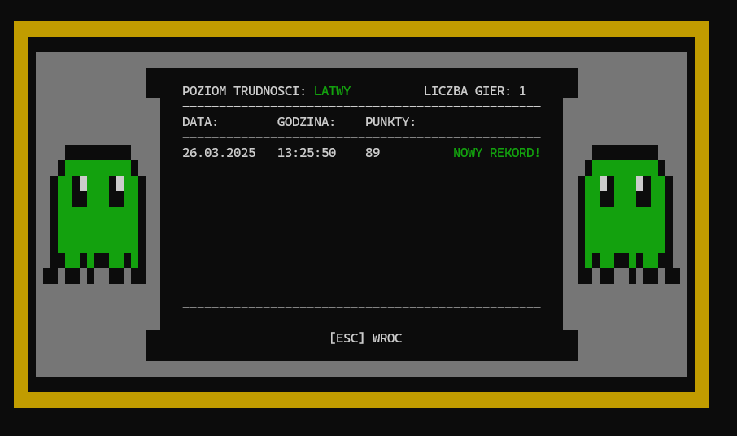
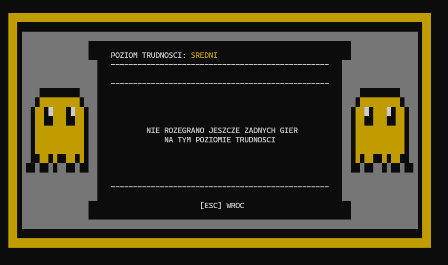
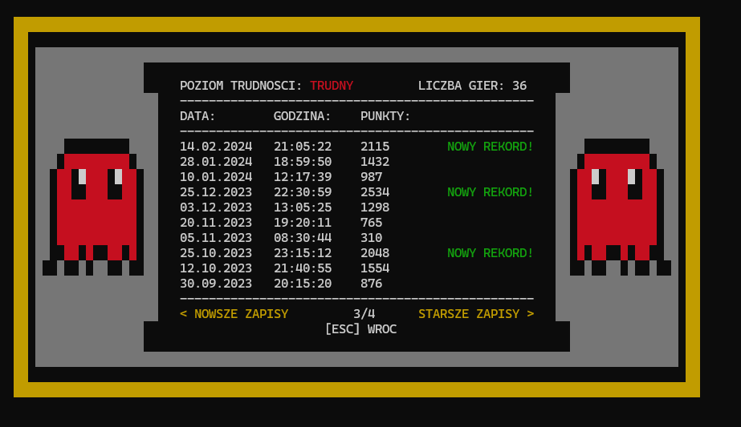
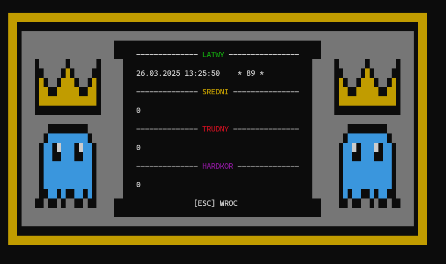
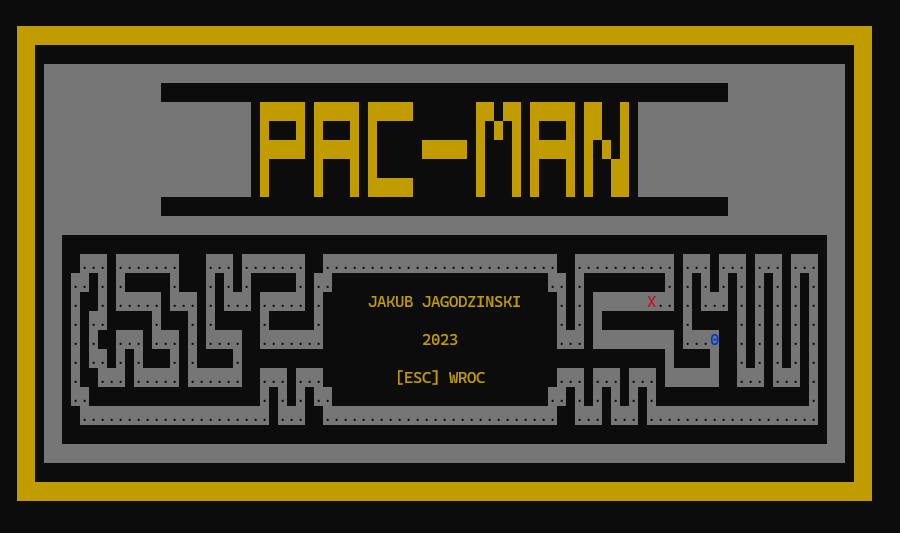
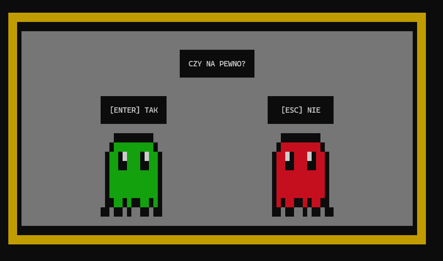
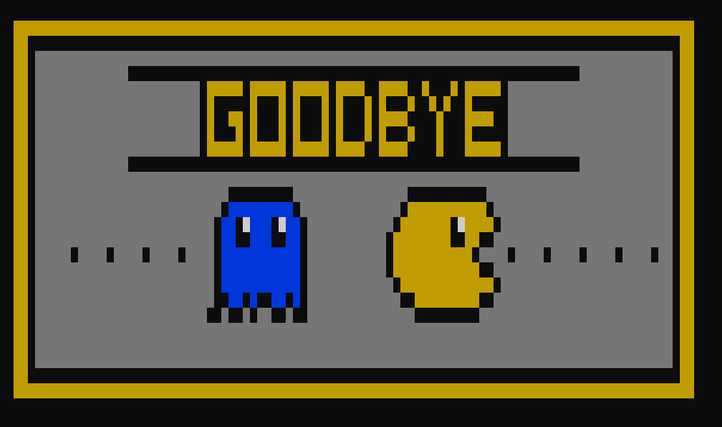

## Author
Jakub Jagodziński
